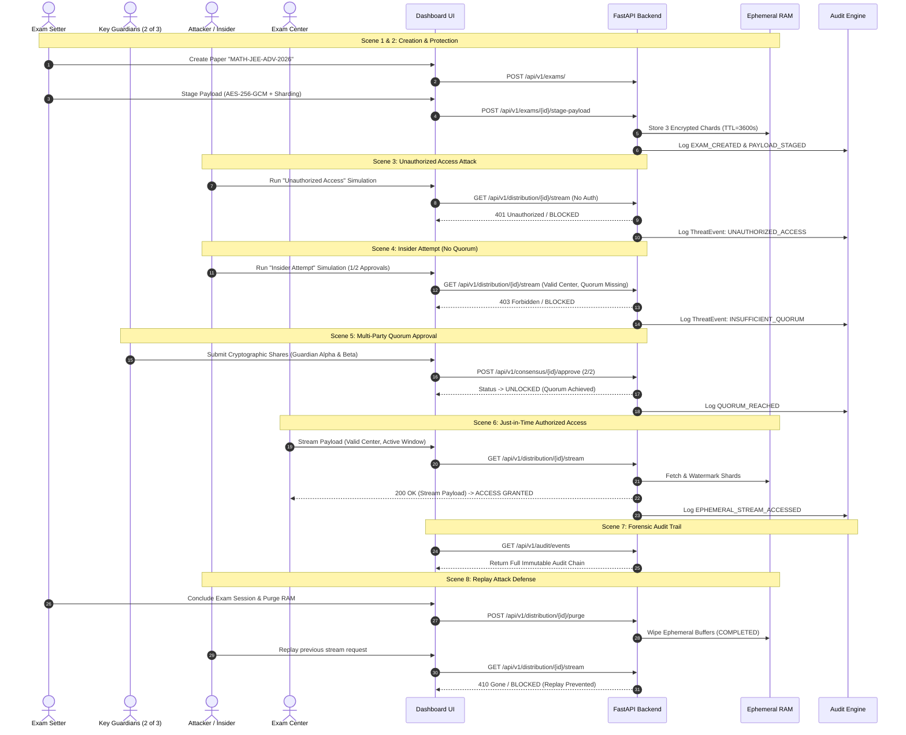

# TrustGuard — SIH Demonstration Script & Evaluator Guide

This document provides the definitive, reproducible step-by-step walkthrough for evaluating the **TrustGuard Zero-Trust Ephemeral Question-Paper Protection System** during the Smart India Hackathon (SIH) live presentation.

---

## 1. System Architecture & Zero-Trust Principles

TrustGuard prevents question paper leaks through four defense barriers:
1. **Zero Persistent Plaintext Storage**: Question papers exist only as encrypted, ephemeral RAM shards.
2. **$k$-of-$n$ Threshold Cryptography**: No single official, administrator, or server possesses the master decryption key. Quorum consensus is mathematically required.
3. **Just-In-Time (JIT) Micro-Window Time-Lock**: Decryption keys and streams are valid exclusively during the scheduled examination window.
4. **Dynamic Traceability & Immutable Auditing**: Every access, denial, vote, and tampering attempt produces a cryptographic audit event.

---

## 2. Demonstration Personas & Test Credentials

All accounts and credentials listed below are **purely synthetic demonstration test personas**:

| Role Persona | Username | Email | Password | Responsibilities in Demo |
|---|---|---|---|---|
| **ADMIN** | `admin` | `admin@trustguard.synth.org` | `AdminPassword2026!` | Overall governance, audit logs, system health |
| **EXAM SETTER** | `exam_setter` | `setter@trustguard.synth.org` | `SetterPassword2026!` | Creates paper, protects payload, stages shards |
| **KEY GUARDIAN 1** | `guardian_alpha` | `guardian1@trustguard.synth.org` | `GuardianPassword1!` | Quorum Guardian Share 1 of 3 |
| **KEY GUARDIAN 2** | `guardian_beta` | `guardian2@trustguard.synth.org` | `GuardianPassword2!` | Quorum Guardian Share 2 of 3 |
| **KEY GUARDIAN 3** | `guardian_gamma` | `guardian3@trustguard.synth.org` | `GuardianPassword3!` | Quorum Guardian Share 3 of 3 |
| **EXAM CENTER** | `center_north` | `center.north@trustguard.synth.org` | `CenterPassword2026!` | Just-in-Time terminal streaming & printing |
| **AUDITOR** | `auditor` | `auditor@trustguard.synth.org` | `AuditorPassword2026!` | Real-time threat log inspection & forensic audit |

---

## 3. Environment Startup & Clean Reset Procedure

### Step 1: Clean Data Reset (Safe Local Development Database)
```bash
# Clean slate: drops local SQLite tables and populates synthetic test personas
python scripts/reset_demo_data.py
```

### Step 2: Start Backend API (FastAPI)
```bash
# Terminal 1: Backend Server (Port 8000)
python -m uvicorn backend.main:app --host 0.0.0.0 --port 8000 --reload
```
*Health Check*: Navigate to `http://localhost:8000/health` (Returns `{"status": "healthy", "ephemeral_store": "ready"}`).

### Step 3: Start Frontend Application (React + Vite)
```bash
# Terminal 2: Frontend Dashboard (Port 5173)
cd frontend
npm run dev
```
*Dashboard URL*: Open `http://localhost:5173/` in Google Chrome / Edge.

---

## 4. The 8 Live Demonstration Scenes



---

### SCENE 1 — CREATE (Question Paper Creation)
- **Actor Persona**: `exam_setter` (Exam Setter)
- **Action**:
  1. Open the TrustGuard UI at `http://localhost:5173/`.
  2. Navigate to **"Create Exam"** / **"Papers"**.
  3. Create an exam:
     - **Title**: `National Competitive Exam 2026 - Mathematics Paper 1`
     - **Course Code**: `MATH-JEE-ADV-2026`
     - **Quorum Configuration**: Threshold $k=2$, Total Guardians $n=3$.
     - **Window**: Scheduled for today (e.g. 09:00 AM - 12:00 PM).
- **Backend API**: `POST /api/v1/exams/` $\to$ Returns `201 Created`.
- **Expected UI State**: Status badge shows **`DRAFT`**.
- **Security Result**: Only metadata stored in PostgreSQL/SQLite. No plaintext question paper is ever persisted to database disk.

---

### SCENE 2 — PROTECT (Cryptographic Protection & Ephemeral Staging)
- **Actor Persona**: `exam_setter` (Exam Setter)
- **Action**:
  1. Assign 3 Key Guardians (`guardian_alpha`, `guardian_beta`, `guardian_gamma`).
  2. Click **"Protect & Stage Encrypted Payload"**.
  3. The client uploads synthetic question paper content (`TRUSTGUARD_DEMO_PAPER`).
  4. The security engine encrypts the payload using AES-256-GCM and shards the ciphertext into 3 discrete cryptographic fragments with SHA-256 integrity hashes.
- **Backend API**:
  - `POST /api/v1/exams/{id}/guardians` $\to$ Returns `201 Created`.
  - `POST /api/v1/exams/{id}/stage-payload` $\to$ Returns `200 OK`.
- **Expected UI State**: Status transitions to **`CONSENSUS_PENDING`**.
- **Security Result**: Raw encrypted shards are loaded into volatile ephemeral RAM with TTL auto-expiration. The database holds only the SHA-256 manifest hash.

---

### SCENE 3 — ATTACK (Unauthorized Access Attempt)
- **Actor Persona**: Simulated External Adversary / Unauthenticated Terminal
- **Action**:
  1. Navigate to the **"Attack Simulator"** page (`/simulator`).
  2. Select scenario: **"Unauthorized Access (External Attacker)"**.
  3. Click **"Execute Simulated Attack"**.
- **Backend API**: `POST /api/v1/simulation/run` with `scenario_type: UNAUTHORIZED_ACCESS`.
- **Expected UI State**:
  - Visual Classification: **`BLOCKED`** (Crimson card, bold status).
  - Actual Decision: `DENY`.
  - Risk / Severity: `CRITICAL`.
  - Audit Event ID generated and displayed in real-time.
- **Security Result**: `401 Unauthorized` / `403 Forbidden` enforced. 0 plaintext disclosed, 0 cryptographic keys leaked. Security engine logs `UNAUTHORIZED_ACCESS_ATTEMPT`.

---

### SCENE 4 — INSIDER ATTEMPT (Insufficient Quorum Bypass)
- **Actor Persona**: Valid Authenticated Officer (`exam_setter` or single guardian)
- **Action**:
  1. On the **"Attack Simulator"** page, select **"Insider Misuse (Premature Access)"**.
  2. Officer attempts direct decryption/streaming with only 1 of 2 required approvals.
  3. Click **"Execute Simulated Attack"**.
- **Backend API**: `POST /api/v1/simulation/run` with `scenario_type: INSIDER_ATTEMPT`.
- **Expected UI State**:
  - Visual Classification: **`INVALID AUTHORIZATION`** (Amber card).
  - Actual Decision: `DENY`.
  - Detail: *"Distribution forbidden: Exam status is 'CONSENSUS_PENDING', quorum approval is required"*.
- **Security Result**: The threshold gatekeeper rejects the request. Valid authentication alone is insufficient without multi-party consensus.

---

### SCENE 5 — QUORUM (Multi-Party Consensus Achieved)
- **Actor Persona**: `guardian_alpha` and `guardian_beta` (Key Guardians)
- **Action**:
  1. Key Guardian 1 (`guardian_alpha`) submits cryptographic threshold approval share token.
  2. Key Guardian 2 (`guardian_beta`) submits cryptographic threshold approval share token.
  3. Quorum threshold reached ($2 / 2 \ge k$).
- **Backend API**:
  - `POST /api/v1/consensus/{id}/approve` $\to$ Returns `200 OK` (`quorum_reached: false`, `new_exam_status: "CONSENSUS_PENDING"`).
  - `POST /api/v1/consensus/{id}/approve` $\to$ Returns `200 OK` (`quorum_reached: true`, `new_exam_status: "UNLOCKED"`).
- **Expected UI State**: Status changes dynamically to **`UNLOCKED`** (Emerald badge with active lock icon).
- **Security Result**: Master key reconstruction threshold is unlocked in RAM without ever storing the reconstructed key on disk.

---

### SCENE 6 — AUTHORIZED ACCESS (Just-In-Time Decryption & Stream)
- **Actor Persona**: `center_north` (Authorized Exam Center)
- **Action**:
  1. Exam Center terminal accesses the streaming distribution endpoint during the scheduled time window.
  2. The backend streams watermarked ephemeral chunks.
  3. The center reconstitutes shards, validates SHA-256 integrity, and performs AES-256-GCM decryption.
- **Backend API**: `GET /api/v1/distribution/{id}/stream` with `Authorization: Bearer <center_north_jwt>`.
- **Expected UI State**: Visual Classification: **`ACCESS GRANTED / ALLOWED`** (Emerald card). Plaintext synthetic paper renders with center-specific dynamic watermark.
- **Security Result**: Zero persistent disk footprint. All fragments validated for cryptographic integrity.

---

### SCENE 7 — AUDIT (Forensic Audit Trail & Threat Log)
- **Actor Persona**: `auditor` (Security Auditor)
- **Action**:
  1. Navigate to **"Audit Logs"** (`/audit`).
  2. Filter by Exam ID `demo-exam-jee-adv-2026`.
  3. Inspect chronological lifecycle records:
     - `EXAM_CREATED`
     - `EPHEMERAL_PAYLOAD_STAGED`
     - `GUARDIAN_ASSIGNED`
     - `UNAUTHORIZED_ACCESS_BLOCKED`
     - `GUARDIAN_APPROVED` (Guardian Alpha)
     - `GUARDIAN_APPROVED` (Guardian Beta)
     - `QUORUM_REACHED`
     - `EPHEMERAL_STREAM_ACCESSED`
- **Backend API**: `GET /api/v1/audit/events?exam_id=demo-exam-jee-adv-2026` $\to$ Returns `200 OK`.
- **Expected UI State**: Complete, tamper-evident audit timeline with actor IDs, IP addresses, action types, and UTC timestamps.
- **Security Result**: Complete forensic traceability for regulatory compliance.

---

### SCENE 8 — REPLAY (Completed Session Purge & Replay Defense)
- **Actor Persona**: Adversary / Compromised Exam Center attempting to reuse tokens
- **Action**:
  1. Exam Setter closes the examination session and clicks **"Purge Ephemeral Memory"**.
  2. Adversary attempts to re-request the distribution stream with the previously valid token.
  3. On the **Attack Simulator**, execute **"Replay Completed Request"**.
- **Backend API**:
  - `POST /api/v1/distribution/{id}/purge` $\to$ Status transitions to `COMPLETED`, RAM wiped.
  - `GET /api/v1/distribution/{id}/stream` $\to$ Returns `410 Gone` (*"Distribution closed: Exam status is 'COMPLETED'"*).
- **Expected UI State**: Visual Classification: **`BLOCKED`** (Crimson badge). Reason: *"Exam session closed / Ephemeral buffers purged"*.
- **Security Result**: Memory buffers zeroized. Completed sessions can never be replayed.

---

## 5. Five-Minute Live Demo Checklist

Use this quick checklist during your live presentation:

- [ ] **T-2 min**: Run `python scripts/reset_demo_data.py` to ensure clean database state.
- [ ] **T-1 min**: Verify backend (`http://localhost:8000/health`) and frontend (`http://localhost:5173/`).
- [ ] **Min 0:00 - 0:45**: Introduce Problem (Paper Leaks) and **Scene 1 (Create Paper)** in UI.
- [ ] **Min 0:45 - 1:30**: Demonstrate **Scene 2 (Cryptographic Protection)** — Explain AES-256-GCM + Sharding + Zero Disk Plaintext.
- [ ] **Min 1:30 - 2:30**: Demonstrate **Scene 3 & 4 (Attack Simulation)** — Show real-time backend blocking of Unauthorized & Insider attempts.
- [ ] **Min 2:30 - 3:30**: Demonstrate **Scene 5 & 6 (Quorum Consensus & JIT Stream)** — Show transition from `CONSENSUS_PENDING` to `UNLOCKED` $\to$ watermarked decryption.
- [ ] **Min 3:30 - 4:15**: Demonstrate **Scene 7 (Audit Logs)** — Show forensic immutable timeline.
- [ ] **Min 4:15 - 5:00**: Demonstrate **Scene 8 (Replay Defense)** — Purge RAM, show `410 Gone` on replay attempt, conclude presentation.
